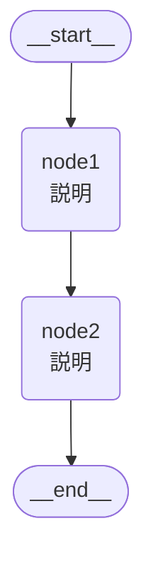

# AI Agents Repository

AIエージェントを作成・管理するためのリポジトリ。

## 技術スタック

- **主要フレームワーク**: LangGraph
- **LLM**: Google Gemini（langchain-google-genai）
- **言語**: Python 3.11+
- **パッケージ管理**: pip + venv

## プロジェクト構造

```
ai-agents/
├── agents/           # 各エージェントの実装
│   └── {agent_name}/ # 個別エージェントディレクトリ
├── shared/           # 共通モジュール
│   └── tools/        # 再利用可能なツール
├── tests/            # テストコード
├── pyproject.toml    # プロジェクト設定
└── .env.example      # 環境変数テンプレート
```

## 開発規約

### エージェント作成時

新しいエージェントは `agents/{agent_name}/` 配下に独立したディレクトリとして作成する。

#### ディレクトリ構成

```
agents/{agent_name}/
├── __init__.py           # パッケージ初期化
├── state.py              # 状態スキーマ（Pydantic BaseModel）
├── nodes.py              # ノード関数（各処理ステップ）
├── graph.py              # LangGraphワークフロー定義
├── README.md             # エージェントの説明・使い方
└── example.py            # 実行サンプル（任意）
```

#### 各ファイルの役割

- **state.py**: 入力・出力・中間状態のスキーマを定義
- **nodes.py**: グラフの各ノードで実行される関数を実装
- **graph.py**: StateGraphでワークフローを構築、`app = compile_graph()` でエクスポート
- **README.md**: 目的、アーキテクチャ図、使い方、入出力パラメータを記述

#### 共通ツール
- 複数エージェントで使うツールは `shared/tools/` に配置し再利用可能にする

### コーディングスタイル
- 型ヒントを必須とする
- docstringはGoogle形式を使用
- linter: ruff
- formatter: ruff format

### LangGraph固有
- ノード関数は単一責任の原則に従う
- 状態スキーマは `TypedDict` または `Pydantic BaseModel` で定義
- グラフ構築は `StateGraph` を使用

#### アーキテクチャ図の作成

READMEにはMermaid形式でグラフ図を記載する。LangGraphの `draw_mermaid()` で自動生成可能:

```python
from agents.{agent_name}.graph import app
print(app.get_graph().draw_mermaid())
```

出力例をREADMEに貼り付け:

````markdown

````

## コマンド

```bash
# 仮想環境有効化
source .venv/bin/activate

# 依存関係インストール
pip install -e ".[dev]"

# テスト実行
pytest

# リント
ruff check .

# フォーマット
ruff format .
```

## 環境変数

`.env` ファイルで管理（`.env.example` を参照）

```
GOOGLE_API_KEY=
LANGCHAIN_TRACING_V2=true
LANGCHAIN_API_KEY=
```

## 今後の拡張予定

- MCPサーバーとの統合
- エージェント間の連携・オーケストレーション
- 追加LLMプロバイダー対応
