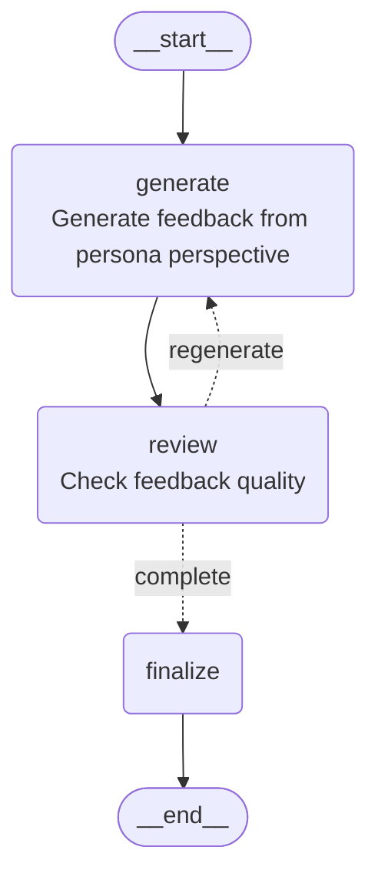

# Customer Persona Feedback Agent

An agent that provides feedback on ideas and concepts from the perspective of a customer persona.

## Overview

To address the common problem of losing customer perspective during product development, this agent generates feedback from the viewpoint of a configured persona. Additionally, a separate node checks the quality of the generated feedback and regenerates it if deemed inappropriate.

## Architecture



- **generate**: Generate feedback by embodying the persona
- **review**: Check feedback quality (score 7+ to pass)
- Regenerates up to 3 times if quality check fails

## Quick Start

```bash
# Run from project root
source .venv/bin/activate
python -m agents.customer_persona.example
```

## Usage

```python
import asyncio
from dotenv import load_dotenv

from agents.customer_persona.graph import app
from agents.customer_persona.state import AgentState

load_dotenv()


async def main():
    # Set initial state
    initial_state = AgentState(
        idea="""
        Budget tracking app "MoneyTrack"
        - Automatically records expenses by taking photos of receipts
        - AI analyzes spending patterns and provides saving advice
        - Family expense sharing feature
        """,
        persona_description="""
        Misaki Tanaka, 35-year-old working mother.
        Family of 4 with 2 elementary school children.
        Not tech-savvy but uses smartphone daily.
        Does household budgeting at end of month,
        finds detailed record-keeping tedious.
        Interested in saving but lacks time.
        """,
    )

    # Run the agent
    result = await app.ainvoke(initial_state)

    # Display results
    print("=== Feedback ===")
    print(result["feedback"].feedback)
    print("\n=== Concerns ===")
    for concern in result["feedback"].concerns:
        print(f"- {concern}")
    print("\n=== Points of Interest ===")
    for interest in result["feedback"].interests:
        print(f"- {interest}")
    print("\n=== Suggestions ===")
    for suggestion in result["feedback"].suggestions:
        print(f"- {suggestion}")
    print(f"\n=== Review Score: {result['review'].score}/10 ===")
    print(f"Iterations: {result['iteration']}")


if __name__ == "__main__":
    asyncio.run(main())
```

## Input Parameters

| Parameter | Type | Description |
|-----------|------|-------------|
| `idea` | str | The idea or concept to evaluate |
| `persona_description` | str | Persona description (free text) |
| `max_iterations` | int | Maximum regeneration attempts (default: 3) |

## Output

| Field | Type | Description |
|-------|------|-------------|
| `feedback` | PersonaFeedback | Feedback from persona perspective |
| `feedback.feedback` | str | Overall feedback |
| `feedback.concerns` | list[str] | Concerns and questions |
| `feedback.interests` | list[str] | Points of interest |
| `feedback.suggestions` | list[str] | Improvement suggestions |
| `review` | ReviewResult | Review results |
| `review.score` | int | Quality score (1-10) |
| `review.is_appropriate` | bool | Whether feedback is appropriate |
| `status` | str | "completed" or "failed" |
| `iteration` | int | Number of iterations executed |

## Persona Configuration Tips

For effective feedback, consider including the following elements:

- **Basic attributes**: Age, gender, occupation, family structure
- **Technical literacy**: IT skill level, commonly used apps
- **Pain points**: Current frustrations and challenges
- **Values**: What they prioritize (time, cost, quality, etc.)
- **Behavioral patterns**: Daily habits, decision-making style
