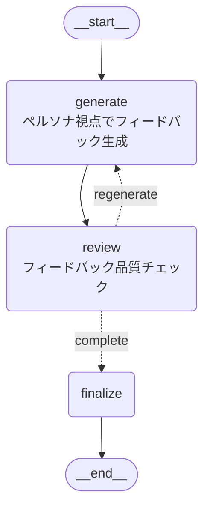

# Customer Persona Feedback Agent

顧客ペルソナになりきってアイデアやコンセプトにフィードバックを返すエージェント。

## 概要

プロダクト開発中に顧客視点を失いがちな問題を解決するため、設定したペルソナの視点でフィードバックを生成します。さらに、生成されたフィードバックの品質を別のノードがチェックし、不適切な場合は再生成を行います。

## アーキテクチャ



- **generate**: ペルソナになりきってフィードバックを生成
- **review**: フィードバックの品質をチェック（スコア7以上で合格）
- 不合格の場合は最大3回まで再生成

## クイックスタート

```bash
# プロジェクトルートから実行
source .venv/bin/activate
python -m agents.customer_persona.example
```

## 使い方

```python
import asyncio
from dotenv import load_dotenv

from agents.customer_persona.graph import app
from agents.customer_persona.state import AgentState

load_dotenv()


async def main():
    # 初期状態の設定
    initial_state = AgentState(
        idea="""
        家計簿アプリ「MoneyTrack」
        - レシートをカメラで撮影すると自動で支出を記録
        - AIが支出パターンを分析して節約アドバイス
        - 家族で支出を共有できる機能
        """,
        persona_description="""
        35歳の共働き主婦、田中美咲。
        小学生の子供が2人いる4人家族。
        ITには詳しくないが、スマホは日常的に使用。
        家計管理は月末にまとめてやるタイプで、
        細かい記録は面倒だと感じている。
        節約には興味があるが、時間がない。
        """,
    )

    # エージェントの実行
    result = await app.ainvoke(initial_state)

    # 結果の表示
    print("=== フィードバック ===")
    print(result["feedback"].feedback)
    print("\n=== 懸念点 ===")
    for concern in result["feedback"].concerns:
        print(f"- {concern}")
    print("\n=== 興味を持った点 ===")
    for interest in result["feedback"].interests:
        print(f"- {interest}")
    print("\n=== 提案 ===")
    for suggestion in result["feedback"].suggestions:
        print(f"- {suggestion}")
    print(f"\n=== レビュースコア: {result['review'].score}/10 ===")
    print(f"反復回数: {result['iteration']}")


if __name__ == "__main__":
    asyncio.run(main())
```

## 入力パラメータ

| パラメータ | 型 | 説明 |
|-----------|-----|------|
| `idea` | str | 評価対象のアイデア・コンセプト |
| `persona_description` | str | ペルソナの説明（自由テキスト） |
| `max_iterations` | int | 最大再生成回数（デフォルト: 3） |

## 出力

| フィールド | 型 | 説明 |
|-----------|-----|------|
| `feedback` | PersonaFeedback | ペルソナ視点でのフィードバック |
| `feedback.feedback` | str | 全体的なフィードバック |
| `feedback.concerns` | list[str] | 懸念点・疑問点 |
| `feedback.interests` | list[str] | 興味を持った点 |
| `feedback.suggestions` | list[str] | 改善提案 |
| `review` | ReviewResult | レビュー結果 |
| `review.score` | int | 品質スコア (1-10) |
| `review.is_appropriate` | bool | 適切かどうか |
| `status` | str | "completed" or "failed" |
| `iteration` | int | 実行された反復回数 |

## ペルソナ設定のコツ

効果的なフィードバックを得るために、以下の要素を含めることをおすすめします:

- **基本属性**: 年齢、性別、職業、家族構成
- **技術リテラシー**: ITスキルレベル、よく使うアプリ
- **課題・ペイン**: 現在困っていること
- **価値観**: 何を重視するか（時間、コスト、品質など）
- **行動パターン**: 日常の習慣、意思決定の仕方
